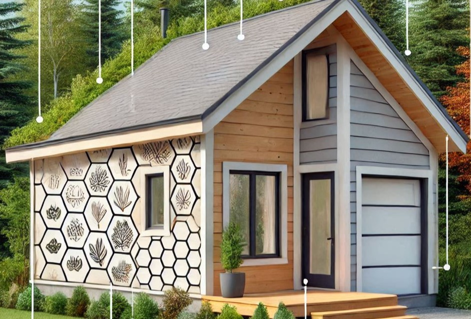
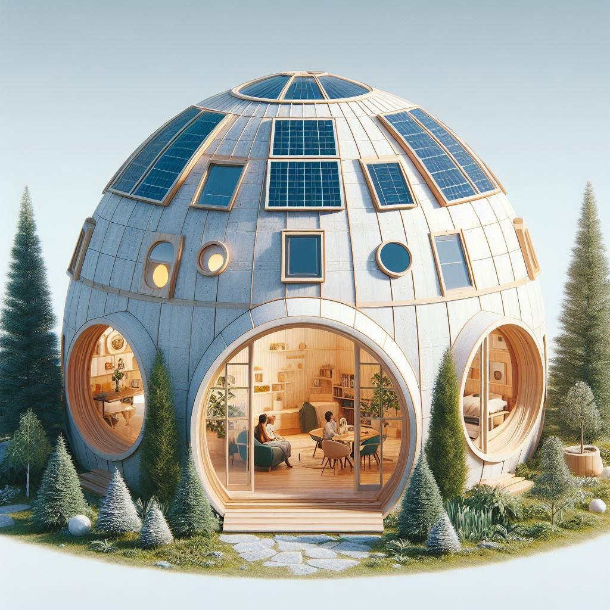

'If it's up to be. It's up to me.' - via Itsa Dan Hawk 

I've been working on figuring out ways via which an incredible safe, good for human abode for the short/mid/longer term, structurally sound, earthquake proof, inclement weather proof, tornado proof, maybe flood proof e.t.c housing structure can be built. Starting at a price point of $5000. I've been looking at adobe earth and other materials in order to bring the cost down substantially. I am particularly keen on keeping the price point down, for a variety of reasons. Most important of which, I feel that housing should be a human-right and there are ways to enable this reality without further causing harm to the biosphere. Plus, with more healthy minds joining the internet and with the emergence of AI, there will be more healthy minds geated towards helping bring further hope and healing.

For Shangrila-VHP, I started tinkering with Microsoft Copilot renders. [link](https://github.com/Shangrila-VHP/shangrila-vhp/tree/main/img) and [link](https://github.com/Shangrila-VHP/shangrila-vhp/tree/main/img/_Archives). Next, I built a model out of a pizza box. In May of the year 2025, I was fortunate to acquire a 3d-printer. Thanks to the incredible generosit of a kid (and their parents) who sold me his older 3d-printer. Right now I am just learning the basics of TinkerCAD. In the following days, I will 3d-print a simply concept of a structure with a door and a hinge. So basiscally taking baby-steps each day.

I post regular updates on 01. The wiki on here. So if you'd like, head over to the wiki. Here is the [link](https://github.com/Shangrila-VHP/shangrila-vhp/wiki). 02. I'll be pulling content off of the other project management system that I've been leveraging over the years and will be placing the content inside of the issues section on Github. Here is the [link](https://github.com/Shangrila-VHP/shangrila-vhp/issues). There is already an issue that is pinned on there. In this issue, I've been placing updates related to the daily ethical hacking/endeavors. So anyone who happens to be interested has an almost real-time view of what has been going on related to Shangrila-VHP. As well, hints at what I've been thinking. 

All the links posted in the wiki are either going to be to Github itself, to youtube. Maybe printables.com in the future. 

If you'd like to collaborate, then please feel free to get in contact. My contact info is via my profile on here. Here is the [link](https://github.com/genidma) Thank you for reading!

---
Legacy text is below

My dream is to house and equip every single individual in the world. Where the individuals can heal, rest, be with their loved ones and also have access to direct support staff. I wish to make a dent in eliminating homelessness in the veterans community. Particularly for anyone who is a veteran or first-line staff and had an injury. Physical, psychological +. I just want to start building tiny-houses and other structures for this purpose.

There has to be a way to build resilient and safe housing structures using earthen materials. Something that can be built for $5000 a unit. This is a render that I generated on December the 31st, 2024 after some preliminary consultations with Microsoft Copilot.

Historically, I was thinking of another means/mechanism for manufacturing and domed shaped facilities for their structural strengths. Inspired by Bucky (Buckminster) Fuller. This is a longer term implementation, whereby changes are needed in the energy landscape. I do see these changes happening. But the question is one of time. As even one minute in the frigid cold or searing heat can cause some serious problems on the human body and mind.

Here is a render from March of 2024. 

# Introduction

---

* Shangrila-VHP - Veterans Healing Places**: 
* * From the day it is officially initiated. The purpose of this vehicle is to:
    * To address and help eliminate homelessness in the veterans, first-responder and front-line staff community as soon as possible. Improving overall and ongoing quality and care during all the times. With a core obsession towards servicing the client.
    * The endeavour will then evolve to solve afforable housing around the world in partnership with the sister organizations. [Aerospace side of things](https://asi.surge.sh/) & [Global Healthcare side of things](https://auh.surge.sh/)
   

The technology is already here. We just need the will to help enable better realities for all. Starting with veterans and first-responders. We enjoy an increasingly better quality of life, because of the sacrifices today and in the past.   

---
* Preliminary budget that I created in February of the year 2023. [First attempt at budgeting - link](https://docs.google.com/spreadsheets/d/1UCKKH7VVqoafzyE_3Dc9-L4a1Vtmi-4Hmhda887AsPc/edit?usp=sharing)
     *  I am constantly working on innovations to help lower the capital expenditure that will go towards the creation of the facilities.
     *  With careful timing, I can already see a time when a $5000 house will be available for anyone on the planet. In a manner that living in the house will be very good for the overall health of the inhabitants.
     *  As well, the structure will shielded from earth-quakes, floods, fire, inclement weather (maybe Tsunamis - but not yet!). I will be sharing the meditations specific to these innovations. Mostly sitting as screenshots on my external drive. Would be great to have some help here!
*  I have been making updates more consistently in the wiki section via Github. Same page here, but easy to miss the section, unless it is specificially highlight. Feel free to check out the [Wiki section here](https://github.com/Shangrila-VHP/shangrila-vhp/wiki)
   
>"Support your veteran community by being an active listener and not passing judgement." - S. Bloom (Jan 25, 2022)

[Note: Front view of one of the buildings.]

1. Phase 01: An objective and key results (OKR) based goals to end veteran homelessness with VA, NATO, and allies.
2. Phase 01-a: Customer Obsession: Taking feedback from the individual Veteran Affairs (for each respective country) on how the designs of the facilities can be improved. 
4. Phase 01-b: In parallel, helping eliminate homelessness in the single parents category. (Completely separate locations managed by completely different staff)
5. Phase 02: Leverage learnings in order to enable sustainable and affordable housing around the world. Infrastructure and designs that will work in the face of climate change and possibly [rapid climate change](https://www.youtube.com/watch?v=ZHNNW8c_FaA) (Sharing does not equal endorsement, as I am not a climate scientist).

Shangrila-VHP will be hands-on in building facilities, ensuring every interaction is meaningful and contributes to a superior living experience. We advocate and work with governments to create lasting solutions for homelessness, guiding individuals towards making a positive impact on society. We believe in the healing power of a supportive environment.

Here are our key principles and starting with Phase 01:

1. **Prioritizing Veteran Homelessness**: We make ending veteran homelessness a top priority. By focusing on this critical issue, we aim to ensure that no veteran is left without a safe place to live. 

2. **Evidence-Based Housing First Approach**: We advocate for evidence-based strategies that prioritize housing as the first step. By providing stable housing, we create a foundation for veterans to rebuild their lives. However, the focus is also towards the creation of physical structures that truly optimize healing vs the traditional design of buildings that can house anywhere from 10 to 1000 people. The intent is to have a finite set of individuals in each habitat. So that the individuals are interacting with the natural habitat in the wider landscape and that their mind is engaged in universally healthy activities. At the same time, specific roles will be available on-site or remotely. Grounded in evidence-based practice and with oversight from an independent auditor, the focus will be on complete and caring healing of the individual. It's taking the 'leave no individual behind' ethos to an increasingly better level.

3. **Reaching Underserved Veterans**: Our efforts extend to all veterans, especially those who may be overlooked or underserved. We work to ensure that no one falls through the cracks. Next, focusing on single parents in need. This is a pain that I have felt personally as a single-parent. (As a civilian). I used to work with a fellow. One of the absolute wonderful individuals that I had met. Some 13 years later, I got a random call from the same individual asking for my fogiveness. I asked them what happened and they told me that they had started abusing drugs. I've had my own struggles with gambling plus. (No drugs). No forgiveness was needed from my side. But shortly thereafter the individual stopped responding to my calls/texts and messages on Linkedin. This individual was a civilian. But I personally had a chance to meet veterans who were suffering. Some, according to themselves, were given bad advice by legal experts to plead guilty in complex cases. Which made me wonder if they were a victim of some kind of a complicated fraud scheme. But on other occasions, their behavior became very erratic. These are not made-up stories. These are very real situations and there is a human life. Obviously, I cannot share the details and the entire set of experiences and in order to protect personal privacy. While, I have never worn a uniform (Minus the first year's NCC just before I immigrated to Canada. link to [NCC via Wikipedia](https://en.wikipedia.org/wiki/National_Cadet_Corps_(Pakistan)) , I feel I am a soldier at heart. And I feel that I am a soldier for good universal reasons. I forgive myself for my mistakes (after having done the work and continue doing it), I forgive others and I don't want anyone to suffer. I wish for them to have hope and healing. I don't care what is the color of your skin or your religion or no religion. It's easy and perhaps instinctive to judge someone else. It is extremely evident that the stressors of warfare take a toll on the body and the mind. We have all enabled the wider reality. The question include, what are our priorities. And how can we afford to ignore the suffering of those who sacrificed everything in order to protect us. For every advocate/lobbyist for a weapons system (and this is not an anti-weapons comment. Not at all.) there should be 20 or 200 advocate for the wellbeing of veterans and first-responders.

4. The issues that I highlight here via this project page are a thread. A thread that is holding stability around the [global reality](https://science.nasa.gov/resource/voyager-pale-blue-dot-download/) I would like very much, if others also got engaged in this vision and showed up with a desire to want to assist and help out. For me, I have no idea how much time I have left on this planet. I believe in Karma and as the vision (and it's not just my vision) manifests, it will help me (and others involved) gather a lot of good karma. It would be my way of giving back. 

5. **Increasing Access to Affordable Housing**: Coming back to the details and there are a lot of different ways via which Shangrila-VHP could evolve. I (Adeel Khan) am personally not invested in one particular approach vs another e.t.c. That being said, for all Phases: Collaboration with governments across all levels is key. This will be necessary for a lot of different reasons. Most important of which is for issues related to safety and security, not disclosing the locations publicly and deter bad and malicious actors from preying on the vulnerable. Going back to not being invested in any particular approach and keeping that crucial consideration in mind. The government of Canada here is taking a different approach here. And different governments and individuals e.t.c can take a different approach towards helping address the issue of homelessness in the veterans community. One approach may involve learning more about how [Bill 150](https://www.leg.state.nv.us/App/NELIS/REL/81st2021/Bill/7544/Text) evolved and the different impact that the passing of this bill has had on sections where the Bill applies. On 12-03-2024, I had an opportunity to attend an informative webinar hosted by VA (Veterans Affairs) for U.S (United States). This webinar was open for civilians to attend. I asked about the feasibility of a 'rent to own' approach as one of the ideas for enabling housing via tiny-homes. Which is not to say that someone who cannot afford to pay rent should not have even a tiny-home abode. I have other ideas and suggestions for that and specially if you review the propose and initial schematic behind Shangrila-VHP. Currently existing as version 1.23. The image is linked below via direct rendering (img src), but it is also accessible via the [following link on Google Drive](https://docs.google.com/drawings/d/1d756NWkBzkvqClDNaT6aavuOxLLRuQuDwqJIDUEPV9g/edit?usp=sharing). In case someone is wondering, why I, as a Canadian mention and highlight so many resources from the States. Well, I had the good fortune for volunteering for a U.S based not for profit. Previously, I had also had the opportunity to connect with a private organization that specializes in the tax incentive offered by IRS in the form of [IRS Opportunity Zones](https://www.irs.gov/credits-deductions/businesses/opportunity-zones). For me, I've always cared about our neighbors and consider myself to be an American also. Actions speak louder than words, that's all I will say. Historically, the Westernized Democracies have stood up for individual liberties and human-rights for all. There is a much longer chain, whereby enlightenment has continued to go wider and then deeper. That is a much longer conversation. But, within reason, I am a giving person. I also wish for my actions to help make reality better for all of life. This is a much longer discussion, which I (Adeel Khan) am personally willing to engage in on the side. Again, within reason. Coming back to the safest and most immediate potential solution. Learnings from SB150 (linked above) could help pave the way for re-zoning the allotment of land. This way, supply of affordable housing structures can be increased. In a manner that is safe, secure and at a price point that will not be a excessive burden on the taxpayers. I am on the fence, because I personally do not wish to make any institution or individual look bad. That is definitely not my intention. But, as a civilization, we have spent Trillions making flying machines. For the price of anywhere from 5 to 10 such machines, we can address homelessless across OTAN in less than a week. **Just take a moment and think about that. ** Now one could say that there the variance between 500 million to 1 Billion dollars (US or CAD) is a doubling. Well, the budget I have proposed is a preliminary budget. I am personally not planning to take a salary from this endeavor. But, I do need you to get involved. Individuals are suffering as I write this and my situation right now and has been historically vulnerable. I am a soldier at heart and I continue to put in the effort. My intention here is to help address the well-being of folks that I have met. I am pulled into different priorities and commitments. It doesn't mean that I wish to turn a blind eye towards the suffering of someone whom I had met. The stressors weighing upon the individual can increase. As poverty, negative impacts on mental health can push an individual towards bad realms. Issues of drug-use and recidivism is a reality amongst veterans. Again, I do not wish to use fear. That is not my intention. It is not fear. This is reality and there are other realities. It is easy to judge someone. But let me ask you. Have you been in a war? Were you ever attacked? What did you do in that situation and why. As I have sought to share before, war (from my extremely limited capacity as a civilian) takes a toll on the individual. For me, I have no idea if humanity will evolve in a Gene Roddenberry type reality. What I know if that war is a reality in the current paradigm and people get hurt. So I need to do something. Because when I went through a tough time in life, I am acutely aware of who helped me. And that is my real family. So coming back to the zoning and again, I am not at all rigid in this approach. Why would I be? Zoning is one way and municipal governments could set zoning for a specific portion of the town/city, in order to allow for housing structures that meet the necessary codes. And then pairing and equipping caregivers who are trained in evidenced based practices in order to help provide hope and healing. The physical structures will have high structural stability. If it's tiny-house kind of a zoning, then individuals may have to congregate in a bunker and if there is a Tornado warning. The physical units will be manufactured 100% locally and inexpensively. Thus provided a stimulus for job creation and help rejuvenate the economies local to the regions. The structure for this is already in place. But issues related to safety inside of the facility and in the general area need definition and work. For me, I am working on designs focused on enabling tiny-housing and other means of enabling housing structures that are safe and have protection against most inclement weather situation. In an ideal situation, a cross-border & across the pond (hopefully worldwide) laboratory will be setup. Not unlike the kind of laboratory that Edison had setup at the [Menlo Park location](https://www.menloparkmuseum.org/history). The lab could evolve in a variety of ways, helping define problems as opportunities. Coming back to the structurs, if the tiny-house approach is taken, then we need to ensure that the units retain structural stability in an earthquake situation (Up until a certain Richter scale. Yet to be determined. And other situations. Some of which have been highlighted above). Getting an individual off the streets and into a shelter must never equate to some kind of harm coming to their body or mind. Nor, should any development enable risks down the line. We cannot expect that the wider climate/environment will be stable. The overall focus is towards enabling designs that lead to increasingly good health. While the ideal ratio for the resident to care-givers and evidence based practitioners has not been determined as of yet. The intention that there is a very high focus on quality of care. In order to protect privacy and ensure a high level of security, it will be advisable not to advertise the location of where these facilities are and there residents and visitors are going to be educated not to post the location via social media and in general. The vision is also aligned with the arc of technological progress for universal positive purposes. For this purpose, the stated goal via one of the sister endeavours [AUH](https://auh.surge.sh/) was to work with Dr. David Hanson & Dr. Ben Goertzel. Whom I do not know personally. This is a separate discussion and there is already technology like this being deployed by VA (Veterans Affairs). But the longer conversation focuses on leveraging technology, robotics, animatronics, virtual humans and more in order to enable more hope and healing. Without distorting the meaning of these efforts and in a manner which is tranparent (within reason). However, care has to be meted how this sub-suggestion is integrated with Shangrila-VHP. So for now, this thought will is more in the domains of the stated vision for AUH (Awake Universal Healthcare) vs Shangrila-VHP itself. As an aside, I would say that the current approach towards using **blanket and broad-brushstrokes** towards saying that AI cannot be aligned, then gaining influence in the position of governance. While not really advocating for sustaining the democratic processes or ensuring that the means via which basic research is sustained can be continued. I would think that these actions speak for themselves. At the same time, those who advocate for these blanket outcomes. Such energies, fail to highlight **how** the means to power civilization can be had now and in the future. Specially considering that the efficacy to see transitional programs occur. Energy systems is one of examples in these realms. The price for not making the transition, despite repeated warnings for generations, most likely, could be nothing short of a C.B.E (Civilization Busting Event). It is not the intention to bring in this somber note. But, from an educated perspective, it is important to evaluate the intentions of the energy behind the proposition. With a core focus on the actions that are being recommend and why. Not necessarily for Shangrila-VHP facilities. But it would be better if there was technology that was developed specifically for healing and care-giving. That this technology could be regularly audited by government officials. [Sample via Dr. David Hanson](https://youtu.be/gUar-oHoDeU?si=qBfXKxN3GWozm8N7) (no affiliation). 

6. **Quality Support Services**: Alongside housing, and to reiterate I emphasize the delivery of support services. Evidence based counseling, substance use treatment, and other wrap-around services play a crucial role in veterans' recovery. Right now, I do not know, how substance use treatment and couseling for other significant issues is going to work. So I will be consulting with trained evidence based practitioners and social workers about this. I am not big on social media and discourage anyone from spending time on social media. I am also very selective on who I follow on social media and increasingly looking at optimizing (and blocking) what kind of advertisements I see. Another conversation. That being said, I see the Elton John AIDS Foundation (EJAF) do good work around the world and it would be great to somehow work in partnership with EJAF. [Source link via EJAF is here](https://www.eltonjohnaidsfoundation.org/our-focus/people-who-use-drugs/)

7. **Preventing Homelessness**: To come back to the main vision. The vision is not only to address existing homelessness but also to prevent it. By creating sustainable solutions, the aim  is to break the cycle of homelessness among veterans and then the wider civilian population. Pull someone up and equip them so that the individuals can help solve problems around the world. The overall, worldwide need for sustainable housing is immense. Some 1.6 Billion individual on the planet still do not have adequate shelter. The longer term vision is to go to space and manufacture the resource in space, in order to help enable thriving communities back on Earth.

[Note: This facility has a community garden in the middle]   

[Note: This facility has been imagined for cities and towns where real-estate is pricier. That's why they are close together. Ideally you want the facilities to be at a distance from each other in order to ensure privacy]

[Note: Nice day in Spring. Air is crisp]

[Note: The facilities are spacious and have a lot of sun-light coming inside. They are mostly powered by solar-panels and have diesel as a backup. Unless, there is the means to be able to connect to hydro provided by the utilities. Here a friend is about to arrive as the resident is wrapping up their reading/chores on the patio]

[Note: A single unit with a family visit and a pet can also be seen. The unit has a StarWars esque feel. Which is not intentional. The units will most probably look different for successive versions and models]

Together, we can build a future where every human (starting with veterans and first-responders) has/have a safe and stable place to call home. The focus is on piloting this project across Canada and the United States, then scaling it across the Western alliance and core allies and going from there. Provided the Governments do not have a concern with the sharing of the designs, the designs could also be licensed in the future at a price point that is very fair and affordable. All accounting will be audited by the governments as part of legal and tax procedures. The profits will be re-invested back towards sustaining and scaling operations.

---

# Hope

At Shangrila Veterans Healing Places, our mission is twofold. We not only provide secure environments for veterans but also advocate for governments, institutions and private donors to engage actively and do more. By working together, we can ensure that everyone thrives in safe and supportive spaces.

The mid to longer term focus is towards helping enable, mixed real-estate. Geographies, where there will be facilities for healing of different types. But also places where veterans and their families could live and work. Where veterans and also civilians could find meaningful work. I want the individuals and families to have the means to own the real-estate, so that they are the ones who benefit and as the price appreciates. Shangrila-VHP isn't going to start and stay in the tiny-homes realm/community. Future designs will be disclosed, for them to be situated when the mechanisms exist. All designs are geared towards reducing suffering (within reason/leveraging care and again - taking a do no harm approach), without distorting the meaning of the effort.

---

# Background
Shangrila Veterans (and first responders) was originally an idea that I thought of around the end of 2022. I had this idea while
I was volunteering my time for a US based non-profit (in a unofficial capacity) and as shared above. Before I continue, I must state that 
personally I am a civilian and I have not been in contact with any government or military (and other associated) 
agency/agencies as of yet, in an official capacity.

## USC ICT
I will not get into my own theories about trauma and inter-generational trauma around the world. And how it plays out in the wider reality. Personally, I have been intrigued with specific projects out of USC (University of Southern California). And
how new and existing technologies are being deployed in order to bring hope and healing into the lives of veterans. There 
are specific technologies developed at USC for treating PTSD (Post Traumatic Stress). That being said, the scope of the Shangrila 
veterans valley & healing places, isn't necessarily PTS focused. But a team of humans and machines could most definitely be incentivized in order 
to further enable designs for effectively treating PTS.

Next, there is particular project out of USC-ICT (Institute of Creative Technologies) called 'Bravemind.' This project has 
been in development for a number of years and here is the [link 
here](https://ict.usc.edu/research/projects/bravemind-virtual-reality-exposure-therapy)

Again, I do not have any affiliation with USC or any other institution. Also, I cannot say that I actively keep update with 
the news and developments related to Bravemind and other projects. 

## OZ Investors (Private entity)
To build upon the details towards the beginning of this post. I had a mixed experience on the Clubhouse app (when I was active there). The quality of the algorithms for this app in particular has a lot to be desired for. That being said, there are a few really awesome places on Clubhouse (rooms inside clubs). One of the rooms is hosted by a for-profit organization called EazyDoIt Inc. The following is must not be considered as legal or financial advice.

*OZ investors **is a private organization** that offers training and consultancy* on a (**public**) tax incentive offered by the US Government via the IRS (Internal Revenue Service). **Note**: Mentioning an institution or 
individual does not equal endorsement. [Link to OZ investment Club - Private institution via 
Clubhouse](https://www.clubhouse.com/join/the-opportunity-zone/InI7VJqN/MEpEBaKV?utm_medium=ch_invite&utm_campaign=ITmGcjtS96JIfy4zlSmIkw-131391) 
and [Link to one of OZ investment's website](https://www.opportunityzoneclub.com/)

## IRS's Opportunity Zones and Opportunity Funds
The actual tax-incentive offered by the IRS is called 'Opportuniy Zones' and according to the IRS website (link below):

'Opportunity Zones are an economic development tool that allows people to invest in distressed areas in the United States.

Their purpose is to spur economic growth and job creation in low-income communities while providing tax benefits to investors.'

[Link to IRS's Opportunity Zone(s) page](https://www.irs.gov/credits-deductions/businesses/opportunity-zones)

> However, I must highlight that Shangrila Veterans Healing Places need not be enabled in distressed communities. On one 
> hand, communities could certainly benefit from the focused and disciplined attitude of veterans and that a rigorous 
> military training would enable. These facilities could be enabled in some of the best neighborhoods. In fact, it is 
> imagined that some of these very locations would in blossom into an amazing and wonderful cluster of communities. That 
> being said, there are tax incentives offered by the IRS and I (personally) starting thinking of investment funds as a 
> vehicle in order to power the development. But as of right now I have not been able to make a lot of progress here. In 
> short, there could be a variety of different facilties in different neighbourhoods. Rural, urban and remote. As well, 
> means and ways of enabling the healing/care-giving/clinical services that will be required. One of 
> the things they talk about in the OZ investors (private/not public) rooms is that sometimes there are properties that are

Coming back to the Opportunity Zones and Opportunity Funds program(s). From my uneducated perspective, these 
incentive structures offered by the IRS have the best of intentions and the thinking behind such a program (to me) seems 
very healthy. The thing to realize is that as good as this program is/could be, this is one of the many possible 
incentives that could be offered by various governments and other institutions around the world.

**We must look into leveraging the designs here in Canada. In order to help bring investments into communities that could really use the investments. But also ensure the means that the capital is coming from good/net healthy sources.
**

From my limited perspective, and going back to the schematic and if I may, that I drafted a couple of years ago. Here is the [link again](https://docs.google.com/drawings/d/1d756NWkBzkvqClDNaT6aavuOxLLRuQuDwqJIDUEPV9g/edit?usp=sharing). All systems are go in order to help alleviate homelessness around the U.S. Seeing that the Government here in Canada takes a more central approach towards most activities. The issues of homlessness can be solved in an efficient and time-bound manner, using different approaches.

# P.I.E: Plan | Implement | Evaluate
## Core considerations & Security and Safety
From my very limited background as a civilian, I would think that the needs within the veteran community are unique. There are  safety and security related considerations to be had. As you probably do not want to have clusters of real-estate, where security is not thought through and that such developments have a very high density of veterans. **Such a design could be a target for individuals and groups who wish to cause harm. Particularly if the details related to the developments are public for the whole world to see.** Next, the medical and other needs of the community 
also need to be thought through in advance. Whether it's to design spaces keeping in mind the physiology and psychological 
setbacks. Or the use of specific types and kinds of encryption, audit logs and other means in order to truly enable a hyper vigilant approach towards protecting records. Next, won't be jumping into solution mode, but maybe such towns/communities do not need as many cars. The landscape is 
designed keeping wheelchairs and also folks using prostethics making use of really wide and super safe side-walks. Other set of designs could be enabled in order to enable work for veterans who are transitioning from military life to civilian life. As well, different designs and processes would be thought through in order to help solve a variety of problems. I have a series of thoughts on how a. How different designs for Shangrila-VHP could be repurposed in order to invigorate the defense industrial base itself. As well, nourish and sustain the means via which basic research is conducted in a safe and equitably manner. As well, thoughts related to technology licensing, going back to the pioneering days of [Fred Terman](https://www.youtube.com/watch?v=Jwk2Y4mi87w). Some of these ideas can be located on my [personal page on Youtube](https://www.youtube.com/c/AdeelKhan1/videos) For e.g the ideas related to the 'Eudaimonia Machine Construct.' Whereby, the others ideas are kind of scattered around.

## Construction of such facilities
Personally, I like to keep a surface level overview of what is/has been going on in the additive-manufacturing space. So 
having done this for more than a decade now (plus/minus), I have some ideas in order to provision physical facilities 
safely and yet inexpensively. Particularly seeing that 3d-printing organizations like ICON 3D have successfully 
collaborated with the US Marines in the recent past. Source link is below and it contains an accompanying video and a 
few images:

[ICON 
3d](https://3dprintingindustry.com/news/u-s-marines-use-icon-3d-printing-to-create-concrete-structures-at-camp-pendleton-174200/)

[ICON 3d - website](https://www.iconbuild.com/), [Wasp - Italy](https://www.3dwasp.com/) are the names of two startups 
operating in this space. There are now dozens (if not more) companies active here on a world-wide basis.

### Applied imagination
During the holiday (2022) season, I started tinkering with [OpenAI's ChaptGPT](https://www.google.com/url?sa=t&rct=j&q=&esrc=s&source=web&cd=&cad=rja&uact=8&ved=2ahUKEwje4fqGobz8AhW5EFkFHQQeCfgQFnoECAkQAQ&url=https%3A%2F%2Fopenai.com%2Fblog%2Fchatgpt%2F&usg=AOvVaw07ciM_LkSe6efpFVXLmYhu)
Coming from a Kurzweilian line of reasoning. I think it is inevitable that agent autonomy will be par with human level by the year 2029. This is not a timeline that Kurzweil has predicted. That's just my uneducated guess. Since the year 2022, I have been tryng to get AIs to write code for me for Blender, FreeCAD and a number of other open-source tools. So this goes back to the general prediction. And a note that we need more smart people to take ownership of realms related to different areas of safety. If you are in Canada, the absolute best way and possibly the most amazing career option is to [join the Forces](https://forces.ca/en/apply-now/). If I can, I would join the Forces in a pico-second! Same if you are in an [OTAN member country](https://www.nato.int/cps/en/natohq/topics_52044.htm)

<!-- 12-03-2024 - Manually edited trom the beginning till here. Will pick up here again. The time right now is 20: 54  --> 

The images below were **not generated with OpenAI** (none of their services). The images below were generated via a 
website from Japan. I forget the name right now. As I ended up cropping these images and choosing to over-write the files 
vs saving a copy.

- Looking at the mountains in the distance, this first image here could be of a drive up to a Shangrila Veterans Healing 
Place community somewhere out on the West coast. **Note*: Apologize for the **arrows** and **like** buttons in the pictures. **Clicking on them is not going to do anything**
!

- Next image is of a wide open space, where hydrogen powered/self-driving buses (with attendants on-board) are parked. 
These buses will pick and drop passengers who do not necessarily live in the healing valleys themselves. But either take 
the buses for the purposes of seeking therapy, recreational activities, leisure, socializing, work e.t.c.
 

- Birds-eye view of one of the developments

- Healthcare, recreational, research facilities and also office spaces

- Drive through one of the neighbourhoods

- Backyard one of the main facilities. Where there will be clinical and other therapeutic services. Outdoor events and 
parties could be held in this backyard. (Weddings, graduation ceremonies e.t.c)

- Another view of the backyard " " with a pond. You could also play mini golf here or just sit by the pond and enjoy the 
sunset. 

- I forget what was the prompt that I provided here. But this could be the drive/walk to a place where you could go for 
quality and nutritious foods. As well, maybe maintain one facility where quality and nutritious foods are prepared by 
robots mostly. 

- Final in this series of images is a collage. I cannot remember the prompt that I provided. But looks like there are some 
fields in some of the images the AI (Artificial Intelligence) generated. 

#### 04-19-2023 Tinkering with Bing image generator. 
Dall-e from OpenAI requires credits from the get go. With the Bing image generator, I get up to 25 requests for free. So I am putting it to good use today. 

Prompt 01:
A veterans healing facility build (should have said built) over a ranch in <redacted>. With swimming pool, outdoor yoga facilities, tennis courts, houses made out of mud and hyperabode and adobe earth, electric buses and veterans with their coaches

 Here are the images that the AI (Bing image generator powered by Dall-E by OpenAI) generated:
 
  
 
 
 
 Prompt 02: 
A veterans healing facility built <redacted>. With an swimming pool, Covered outdoor yoga facilities, community gardens, tennis courts, places for relaxation with hammock, lots of greenery around and flowers, houses made out of mud and hyperabode that are good for the climate, please place a few boxabl casitas there also and adobe earth, electric buses and veterans doing yoga with two coaches (Edited to protect privacy)
 
 Here are the images that the AI generated:

 
 Prompt 03: 
 Same but for a Canadian site: a veterans healing facility built in <redacted>. Two images during the winter and 2 during the summer spring. Covered outdoor yoga facilities, community gardens, tennis courts, places for relaxation with hammock, lots of greenery around and flowers, houses made out of mud and hyperabode that are good for the climate, please place a few boxabl casitas there also, electric buses and veterans doing yoga with a coach
 
 Here are some of the images that the AI generated. Note: Maybe without more credits, it makes sense to get the AI to generate more images inside each tile. So the prompt for Canadian sites may be more useful. At least till more credits can be secured. Also, sometimes the AI mixes and merges the prompts, as it merged a bus and a building together. So maybe more specific prompts are to be provided.
 

 

Overall, I imagine these locations to be mixed real estate facilities for enabling hope and healing.
Whereby humans and robots would collaborate in order to bring hope and healing for veterans, first responders, healthcare 
workers from all over the world. I haven't had a chance to develop the care-giving robots side of things. But I'd love to 
somehow collaborate with Dr. Hanson and Dr. Goertzel and USC ICT (links shared previously)

#Let's Collaborate
I would **absolutely love feedback** and I seek to collaborate with you on this project. It is my hope that this project 
could be undertaken by the veteran community themselves. It would be amazing to see secure, structurally stable, 
intelligently designed architecture take roots. A community that learns from it's experiences and evolves. A community 
where there is no judgement and we lead with an open hand. A community of 'hope and healing.'

## Next steps and if you'd like to join.
- Suggest that you join the project space [here on Github](https://github.com/Shangrila-VHP)
- Also, you may want to connect with me on Linkedin and **make sure** to include a message in your request that you seek to 
collaborate. As I do not log onto Github very often. Here's a [link to my 
profile.](https://www.linkedin.com/in/adeelkhan1/) 

With gratitude.

# Updates
## Tinkering with Floorplanner dot Com back in September 2023
The computer I had been using was older and hence the video is choppy
[Link via Youtube](https://youtu.be/VSZ-Q_O5Ja4?si=1xPU2xHxz4kR86Nn)

## Updates from 01-24-2024
Generated a few renders via some of the apps I was tinkering with. 

### First, via Adobe Firefly generative AI
The prompts that I provided were very basic. As well, these images were generated using generative AI that has been trained on a wide variety of dataset. There are errors that are showing up. Hence, on the next iteration it will be worthwhile to provide a detailed and richer set of prompt to see the difference for the output. That being said, considering that it took me 1.5 hours plus to get going on Floor Plannet dot com (on a slower machine), the fact that AIs can generate content with a simple prompt in seconds is a truly remarkable achievement for humans and machines!

### Then via an online Tool that I found called Maket AI
These are images generated for the purpose of testing out these apps and for demo only. Not expecting cars parked in garages in all residences.

### Earlier on, I made a model out of cardboard
Please excuse the grease that seeped through the cardboard and onto the paper. Originally this was the box in which fried food was placed. Captain Planet.
This is a concept that I have been thinking about. This isn't exactly a tiny house. If this development was built to scale, then you could have multiple rooms inside of this dwelling. The roof would be covered with earth and doing so will help save a lot of money for heating and cooling. In addition to, it has large sun-roofs for natural light and aeration. It also has panels on either side that can be raised like garage doors. Solar panels can be placed on top of these panels. 

For the model itself, I used paper, glue sticks, a little bit of elastic, exacto knife and scissors. And a pen for drawing e.t.c

# Zen Garden Addition

We are excited to announce the addition of a zen garden to our project. The zen garden is designed to provide a peaceful and meditative space for residents. It includes elements such as sand, rocks, and a small tree, creating a serene environment adjacent to the house model.

The zen garden is a beautiful addition that enhances the overall aesthetic and tranquility of the living space. It offers a place for reflection and relaxation, contributing to the well-being of the residents.

We believe that the zen garden will be a valuable feature for our community, promoting mindfulness and a sense of calm.

## All subsequent updates can be located via the [wiki](https://github.com/Shangrila-VHP/shangrila-vhp/wiki)

Thank you and please consider sponsoring this project! It's much needed around the world and can also help create a lot of quality jobs. As well, help improve the human condition! 

