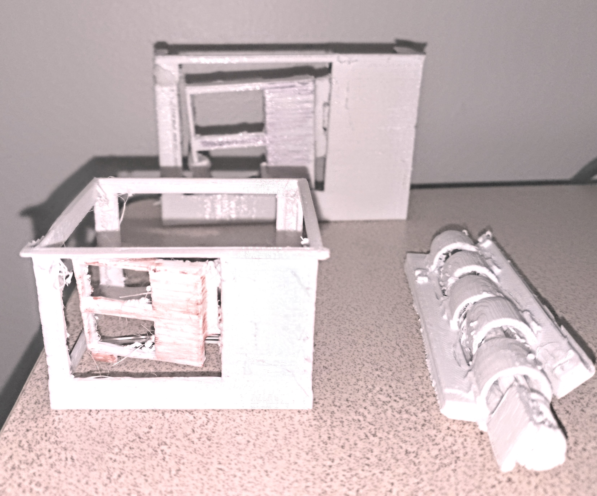
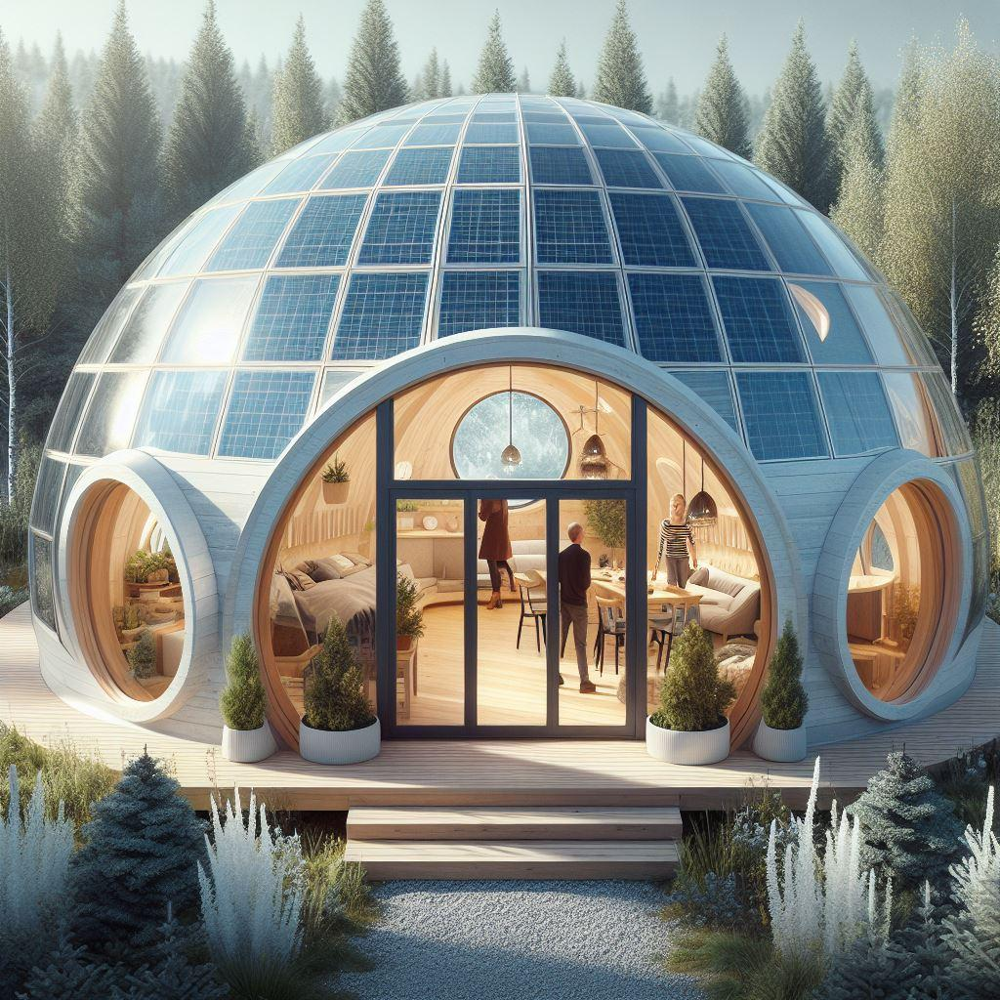
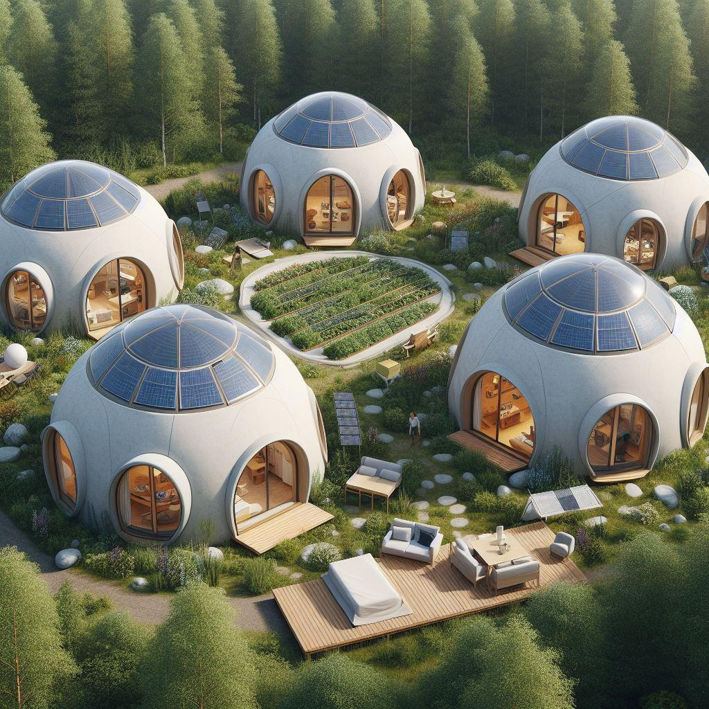
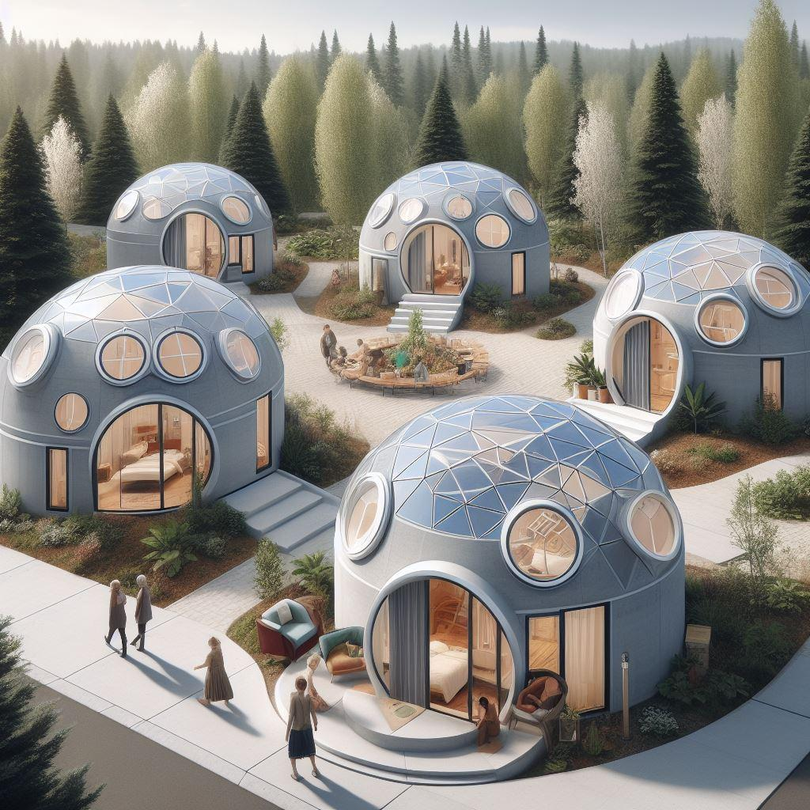
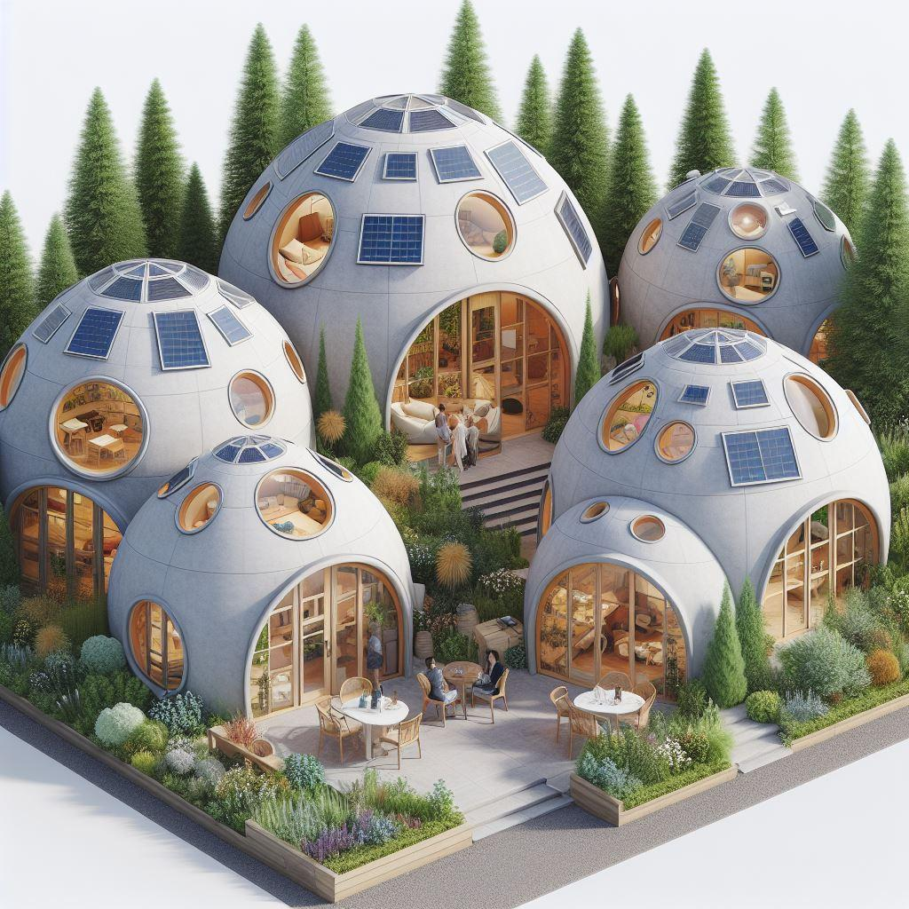
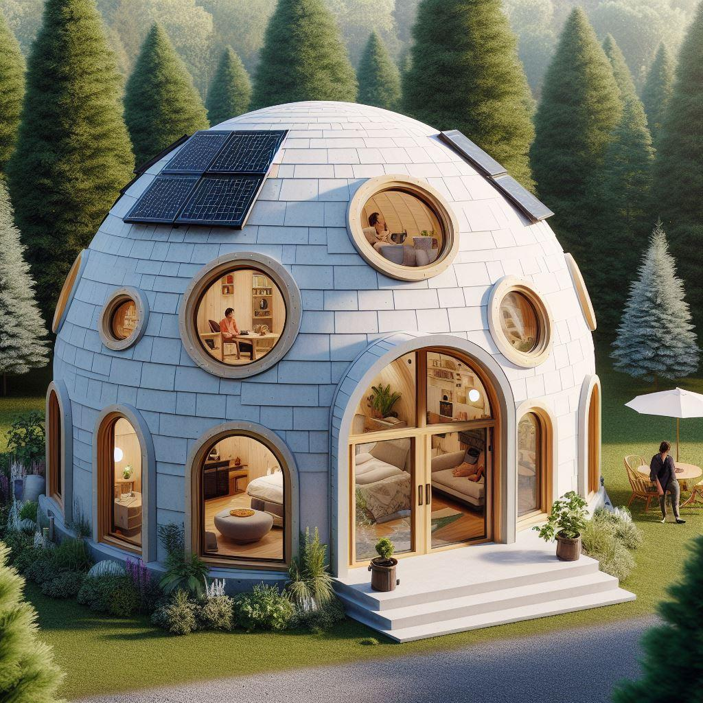
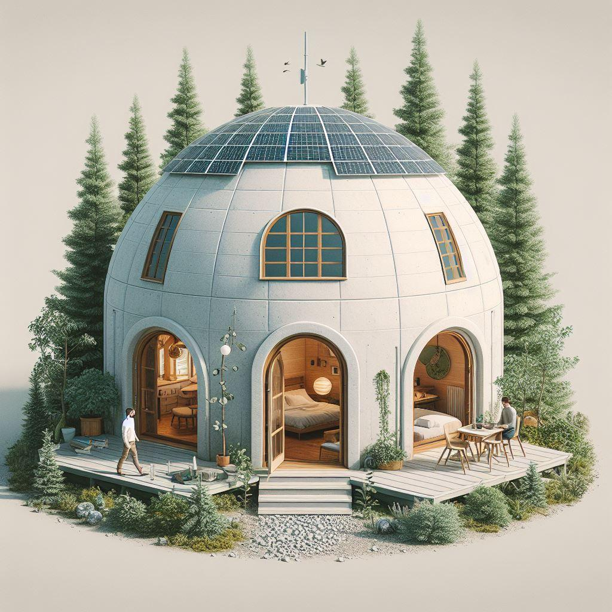
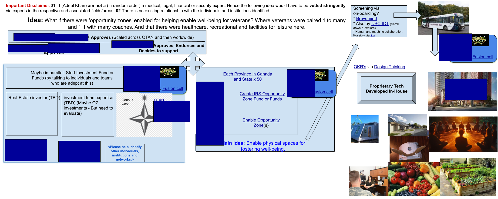

# Shangrila Veterans Healing Places (Shangrila-VHP)

**Evolved from veterans' healing vision (from my civilian perspective) to eco-housing for all—affordable, safe, wholesome living that heals both people and planet.**

> "Dreams are made if people try." — Terry Fox

*Prototype created using TinkerCAD and 3D-printed (June 21, 2025).*

---

## 📋 Table of Contents
- [Mission & Vision](#-mission--vision)
- [Technical Approach](#-technical-approach)
- [Roadmap & Phases](#-roadmap--phases)
- [Progress Gallery](#-progress-gallery)
- [Resource Hub](#-resource-hub)
- [Project Credits](#-project-credits)
- [Collaboration & Contact](#-collaboration--contact)

---

## 🌟 Mission & Vision

Shangrila-VHP is a project that brings the world-wide community together to enable hope and healing.

### Core Metrics & Focus
- **Target Cost**: $5,000 CAD (plummeting to $1,000 or less within 10 years).
- **Primary Focus**: Veterans housing, single parents, and those experiencing homelessness.
- **Next Focus**: Global scale-up.
- **Impact**: Healing-focused community design.

> "Less, but better."
> — Dieter Rams, *Ten Principles for Good Design*

### The Problem
**Every homeless veteran/first-responder is one too many** — a solvable problem. NATO and allies first, then quality housing for all worldwide.

---

## 🛠️ Technical Approach

### Rammed Earth
I've been talking to a contact. 
- Option # 1 is to license the technology
- Option # 2 involves a different technique employing humanoid robots and humans separately. This approach is thanks to an innovator from Egypt, who's work has built upon pioneers in this area from the past. But he has also inspired advanced research in France (at a specific Polytechnic University)

### Large-Scale 3D Printing
Large-scale open-source 3D-printers capable of printing with earthen materials.

- This is already a reality, but the designs are not open-source. 
- So we can open-source the designs and then individuals and groups can start developing climate resilient communities. With means to off set the harmful effects of climate change and enable pocket climates. For this to happen, the design of the towns will have to be limited. These communities will be as self-sustainable as possible.

To come back to this sub-idea:

- **In-house Development**: Cost-effective alternative to expensive commercial printers.
- **Materials**: Mud and organic mixtures for sustainable, high-quality dwellings.

### Modular & Autonomous Manufacturing
- **MVP (Minimum Viable Product)**: Focused on modular designs (e.g., doors and hinges) so structures can be moved or expanded.
- **Autonomous Manufacturing Units (AMUs)**: Exploring self-replicating manufacturing units to safeguard the future through education and automation.
  - - Note: The heavy lifting is via a sister organization via [ASI or Awakened Imagination - Yet to be registered](https://github.com/stellardreams/asi.surge.sh)

---

## 🗺️ Roadmap & Phases

1.  **Phase 01**: OKR-based goals to end veteran homelessness with VA, NATO, and allies.
2.  **Phase 01-a**: Customer Obsession — feedback from Veteran Affairs on facility designs.
3.  **Phase 01-b**: Parallel elimination of homelessness in the single parents category.
4.  **Phase 02**: Global leverage for sustainable/affordable housing resilient to climate change.

---

## 🖼️ Progress Gallery

### Renders & Concepts
| Community Hub | Living Units | Lush Environments |
| :--- | :--- | :--- |
|  |  |  |
|  |  |  |

### Prototyping History
- **Pizza Box Model**: The very first conceptualization used recycled materials.
- **TinkerCAD & 3D Printing**: Transitioned to digital design and physical scale models.
- **Zen Garden Addition**: Meditative spaces integrated into the living environment for tranquility.

---

## 📚 Resource Hub

- **[DIY Shelter Plans](plans/plans.md)**: Empowering individuals with vetted construction methods.
- **[Ethical Hacking & Updates (Issue #58)](https://github.com/Shangrila-VHP/shangrila-vhp/issues/58)**: Real-time view of daily endeavors and project thoughts.
- **[Project Wiki](https://github.com/Shangrila-VHP/shangrila-vhp/wiki)**: Regular updates and extracted project management content.
- **[Issue Tracker](https://github.com/Shangrila-VHP/shangrila-vhp/issues)**: Ongoing tasks and community feedback.

---

## ✍️ Project Credits

- **Author**: Antigravity (AI Assistant)
- **Co-Collaborator**: [@genidma](https://github.com/genidma) (Adeel Khan)

---

## 🤝 Collaboration & Contact

"Dreams are made if people try." We would love your feedback and collaboration!

- **Join the Discussion**: [Shangrila-VHP GitHub Organization](https://github.com/orgs/Shangrila-VHP/discussions)
- **Connect on LinkedIn**: [Adeel Khan](https://www.linkedin.com/in/adeelkhan1/) (Please include a message about collaborating!)
- **Support**: Consider sponsoring this project to help create quality jobs and improve the human condition.

---
*Thank you for reading and being part of the solution.*
