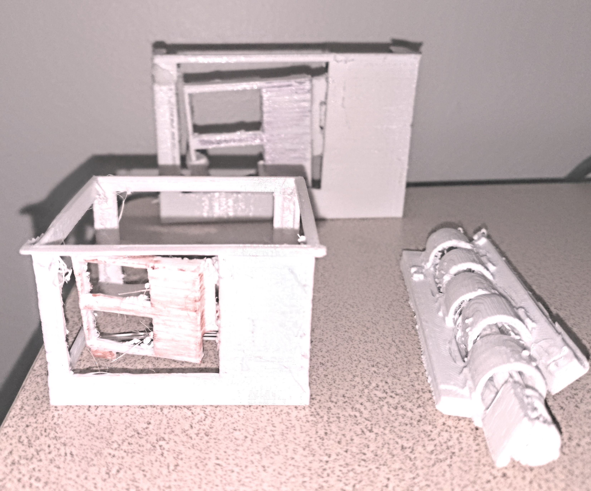
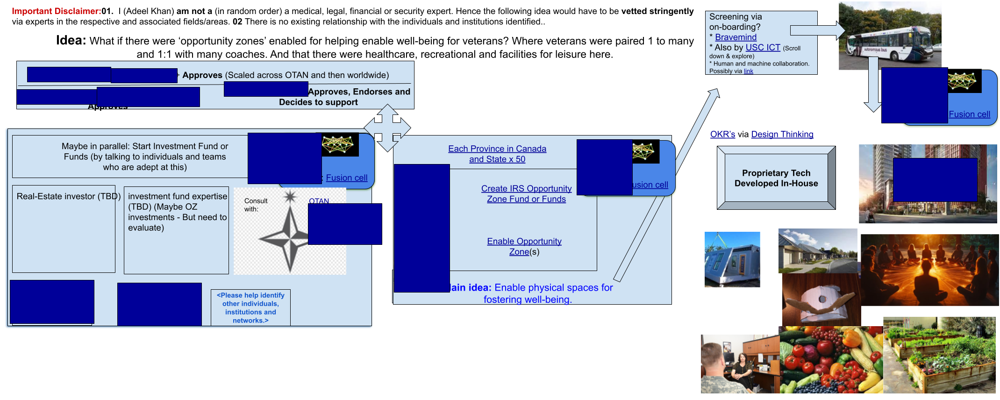

# Shangrila Veterans Healing Places (Shangrila-VHP)

**Evolved from veterans' healing vision (from my civilian perspective) to eco-housing for all—affordable, safe, wholesome living that heals both people and planet.**

> "Dreams are made if people try." — Terry Fox

People don’t heal because of wood walls or a lake view.
They heal because:

- the pace slows
- the noise drops
- the nervous system finally gets to exhale
- the environment stops demanding constant vigilance
- the mind has room to wander instead of brace

— [Copilot by Microsoft](https://copilot.microsoft.com/)

*Prototype created using TinkerCAD and 3D-printed (June 21, 2025).*

---

- [Table of Contents](#table-of-contents)
- [Mission & Vision](#mission--vision)
- [Project Philosophy](PHILOSOPHY.md)
- [Technical Approach](#technical-approach)
- [Roadmap & Phases](#roadmap--phases)
- [Progress Gallery](#progress-gallery)
- [Resource Hub](#resource-hub)
- [Project Credits](#project-credits)
- [Collaboration & Contact](#collaboration--contact)
- [Wiki](https://github.com/Shangrila-VHP/shangrila-vhp/wiki)

---

## Mission & Vision

Shangrila-VHP is a project that brings the world-wide community together to enable hope and healing.

### Core Metrics & Focus
- **Target Cost**: $5,000 CAD (plummeting to $1,000 or less within 10 years).
- **Primary Focus**: Veterans housing, single parents, and those experiencing homelessness.
- **Next Focus**: Global scale-up.
- **Impact**: Healing-focused community design.

> "Less, but better."
> — Dieter Rams, *Ten Principles for Good Design*

### The Problem
**Every homeless veteran/first-responder is one too many** — a solvable problem. NATO and allies first, then quality housing for all worldwide.

---

## Technical Approach

### Rammed Earth
I've been talking to a contact about licensing technology or partnering with an innovator from Egypt whose work builds upon pioneers in this area and has inspired advanced research in France (at a specific Polytechnic University).

### Earthship inspired designs
- See [earthship.com/](https://earthship.com/). No affiliation
- - Game-plan: Learn directly from the founders and supporters of Earthship Biotecture.
- - - Two options: 
- - - - Option # 1: Training via the main website [here](https://earthship.com/learn/)
- - - - Option # 2: Training via [backstage.earthship.com](https://backstage.earthship.com/pricing)

### Large-Scale 3D Printing
Large-scale open-source 3D-printers capable of printing with earthen materials.

- This is already a reality, but the designs are not open-source. 
- So we can open-source the designs and then individuals and groups can start developing climate resilient communities. With means to off set the harmful effects of climate change and enable pocket climates. For this to happen, the design of the towns will have to be limited. These communities will be as self-sustainable as possible.

- **In-house Development**: Cost-effective alternative to expensive commercial printers.
- **Materials**: Mud and organic mixtures for sustainable, high-quality dwellings.

### Modular & Autonomous Manufacturing
- **MVP (Minimum Viable Product)**: Focused on modular designs (e.g., doors and hinges) so structures can be moved or expanded.
- **Autonomous Manufacturing Units (AMUs)**: Exploring self-replicating manufacturing units to safeguard the future through education and automation.
  - - Note: The heavy lifting is via a sister organization via [ASI or Awakened Imagination - Yet to be registered](https://github.com/stellardreams/asi.surge.sh)

---

## Roadmap & Phases

1.  **Phase 01**: OKR-based goals to end veteran homelessness with VA, NATO, and allies.
2.  **Phase 01-a**: Customer Obsession — feedback from Veteran Affairs on facility designs.
3.  **Phase 01-b**: Parallel elimination of homelessness in the single parents category.
4.  **Phase 02**: Global leverage for sustainable/affordable housing resilient to climate change.

---

## Progress Gallery

### Prototyping History
- **Pizza Box Model**: The very first conceptualization used recycled materials.
- **TinkerCAD & 3D Printing**: Transitioned to digital design and physical scale models.
- **Zen Garden Addition**: Meditative spaces integrated into the living environment for tranquility.

---

## Budget Overview

### Single Site (1 year)

*Note: This budget section is synced with the [Google Sheets Budget](https://docs.google.com/spreadsheets/d/1UCKKH7VVqoafzyE_3Dc9-L4a1Vtmi-4Hmhda887AsPc/edit?usp=sharing). Please update the Google Sheet first, then port changes here.*

| Category | Capex | Opex | Notes |
|----------|-------|------|-------|
| Architectural consultation | $40,000 | - | Made-up value, not confirmed with contact |
| Tiny Home Consultation | $154,847 | $0 | Lindsay Wood & Zack Giffin |
| Construction (earthen materials) | $100,000 | - | Cost reduced significantly |
| Land purchase | $5,800,000 | - | Single biggest cost; opportunity zone consideration |
| Computers & software | $840 | $220 | 4 laptops + cloud software |
| Furniture (DIY) | $6,426 | - | Budget estimate, DIY approach |
| Wood working tools | $1,186 | - | |
| Vehicles (2 golf carts) | $40,000 | $5,000 | |
| Patents (IP) | $100,000 | $25,000 | |
| Food | - | $103,200 | $200/person/month × 43 people |
| Salaries (non-Coaches) | $694,388 | - | GP, nurse, mental health practitioner, cook, security, admins |
| Salaries (PD Coaches) | $100,000 | - | Personal Development (PD) Coach - 1 per site |
| Accounting & legal | $5,000 | $10,000 | |
| Bank charges | $600 | $500 | |
| Sales & marketing | $2,000 | - | |
| Office supplies | - | $300 | |
| Repairs | - | $3,000 | |
| Utilities | - | $18,600 | Internet, phone, hydro, gas, water |
| Microsoft Flight Simulator | $109 | - | |
| Flying lessons (×5) | $110,950 | - | |
| Cessna purchase | $30,000 | - | |
| Maintenance & fuel | - | $25,000 | |

### Totals (1 site, 1 year)
| Scenario | Capex | Opex | Combined |
|----------|-------|------|----------|
| With land | $7,186,346 | $190,820 | $7,377,166 |
| Without land (donated) | $1,386,346 | $190,820 | $1,577,166 |

*Note: Opex breakdown in table above shows individual items totaling $190,820. The original Google Sheet shows Total Opex as $6,862,208—please verify which figure is correct.*

### Land (Potential Donation)
- **Land purchase**: $5,800,000
- *Note: Land may be donated by governments or private donors. This has happened in similar projects. See opportunity zones.*

### Nationwide Projections (Not accurate - based on combined with land)
| Country | Estimated Cost |
|---------|---------------|
| USA | $383,612,632 |
| Canada | $95,903,158 |
| UK | $73,771,660 |
| Australia | $59,017,328 |
| New Zealand | $44,262,996 |
| Germany | $118,034,656 |
| France | $132,788,988 |
| Ukraine | $177,051,984 |
| Turkey | $295,086,640 |

*Note: These are rough estimates and require further analysis. Does not include Rest of Alliance or Allies.*

---

## Resource Hub

- **[DIY Shelter Plans](plans/plans.md)**: Empowering individuals with vetted construction methods.
- **[Project Wiki](https://github.com/Shangrila-VHP/shangrila-vhp/wiki)**: Regular updates and extracted project management content.
- **[Issue Tracker](https://github.com/Shangrila-VHP/shangrila-vhp/issues)**: Ongoing tasks and community feedback.

---

## Project Credits
- **pioneer**: [@genidma](https://github.com/genidma) (Adeel Khan)
- **wing person 01**: antigravity (AI Assistant)
- **wing person 02**: claude (AI Assistant)
- **wing person 03**: copilot (AI Assistant)
- **wing person 04**: kilo (kilo-auto/free model)

---

## Collaboration & Contact

"Dreams are made if people try." We would love your feedback and collaboration!

- **Join the Discussion**: [Shangrila-VHP GitHub Organization](https://github.com/orgs/Shangrila-VHP/discussions)
- **Open Issues**: [Report bugs or request features](https://github.com/Shangrila-VHP/shangrila-vhp/issues)
- **Support**: Consider [sponsoring this project](https://github.com/sponsors/genidma) to help create quality jobs and improve the human condition
- **Connect on LinkedIn**: [Adeel Khan](https://www.linkedin.com/in/adeelkhan1/) (Please include a message about collaborating!)

---
*Thank you for reading and being part of the solution.*
