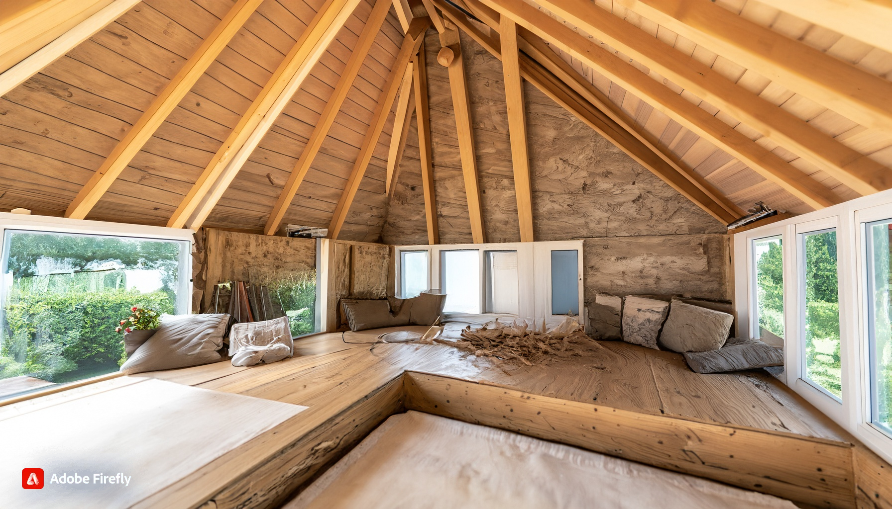

# Introduction

---

**Shangrila Veterans Healing Places**: Creating and encouraging the creation of Safe Havens. Starting with veterans and single-parents.

At **Shangrila Veterans Healing Places**, the primary mission is to provide safe and secure environments where veterans can find hope and healing, assisted by evidence based practitioners. Every veteran in every single country, deserves a stable and comfortable place where they can heal. The intention is to scale Shangrila-VHP in successive phases.

1. Phase 01: An objective and key results (OKR) set for eliminating homeless in the veteran community. Working with VA and NATO and allies.
2. Phase 01-a: On-going support and incremental innovation.
3. Phase 01-b: Handing the operations over to individual Veteran Affairs
4. Phase 02: Helping eliminate homelessness in the single parents category.
5. Phase 03: By the beginning of Phase 03, there should be enough learning, in order to enable the construction and scaling of sustainable communities all over the world. It has yet to be determined and too early to tell, if climate resiliency is also going to be part of the scope.

Coming back to Phase 01. Shangrila-VHP is going to be actively involved in the construction of the facilities. As every single touch-point and interaction matters. The clients and also the residents must have a secure/superb/superior living experience. Our approach also involves advocacy and collaborating with governments for enabling sustainable solutions to help turn homelessness and enable designs where the individual is on a path to become a phenomenal contributor back to society. Sometimes life gets challenging and we need a caring/compassionate environment where we can heal our bodies and our minds. 

Here are our key principles and starting with Phase 01:

1. **Prioritizing Veteran Homelessness**: We make ending veteran homelessness a top priority. By focusing on this critical issue, we aim to ensure that no veteran is left without a safe place to live. 

2. **Evidence-Based Housing First Approach**: We advocate for evidence-based strategies that prioritize housing as the first step. By providing stable housing, we create a foundation for veterans to rebuild their lives. However, the focus is also towards the creation of physical structures that truly optimize healing vs the traditional design of buildings that can house anywhere from 10 to 1000 people. We are focusing on a finite set of individuals in each habitat. So that they are interacting with the natural elements and that their mind is engaged in universally healthy activities.

3. **Reaching Underserved Veterans**: Our efforts extend to all veterans, especially those who may be overlooked or underserved. We work to ensure that no one falls through the cracks.

4. **Increasing Access to Affordable Housing**: For all Phases: Collaboration with governments across all levels is key. This will be necessary for re-zoning and possibly allotment of land, so that supply of affordable housing options can be increased. Safe and secure housing is essential for the well-being of all individuals and families. We do this by encouraging municipal government to set the zoning for a specific portion of the town/city to allow housing structures that meet the necessary codes. These structures will have high structural stability. But individuals may have to congregate in a bunker and if there is a Tornado warning. These units will be manufactured 100% locally and inexpensively. Thus provided a stimulus for job creation and help rejuvenate the economies local to the regions. In our own labs, we are working on designs focused on enabling tiny-housing and other means of enabling housing structures that are safe and have protection against most inclement weather situation. The lab will also work towards ensuring that the units retain structural stability in an earthquake situation (Up until a certain Richter scale. Yet to be determined). The overall focus is towards enabling designs that lead to increasingly good health. While the ideal ratio for the resident to care-givers and evidence based practitioners has not been determined as of yet. It is the intention that there is a very high focus on quality of care. At least for Phase 01 and relating to the well-being of the veteran population. In order to protect privacy and ensure a high level of security, it will be advisable not to advertise the location of where these facilities are and there residents and visitors are going to be educated not to post the location via social media and in general.

5. **Quality Support Services**: Alongside housing, we emphasize the delivery of support services. Evidence based counseling, substance use treatment, and other wrap-around services play a crucial role in veterans' recovery. I (Adeel Khan) am not sure how the substance use treatment and couseling for other significant issues is going to work. So I will be consulting with trained evidence based practitioners and social workers about this.

6. **Preventing Homelessness**: Our goal is not only to address existing homelessness but also to prevent it. By creating sustainable solutions, we aim to break the cycle of homelessness among veterans and then the wider civilian population. Pull someone up and equip them so that the individuals can help solve problems around the world. The overall, worldwide need for sustainable housing is immense. Some 1.6 Billion individual on the planet still do not have adequate shelter. The longer term vision is to go to space and manufacture the resource in space, in order to help enable thriving communities back on Earth.
   

Together, we can build a future where every human (starting with veterans and first-responders) has a safe and stable place to call home. The focus is on piloting this project across Canada and the United States, then scaling it across the Western alliance and core allies and going from there. Provided the Governments do not have a concern with the sharing of the designs, the designs could also be licensed in the future at a price point that is very fair and affordable. 

---

<!-- Will keep these other options. Or should I. Hmm.

-->

<!--
Try inside a p tag

 

-->

# Hope

At Shangrila Veterans Healing Places, our mission is twofold. We not only provide secure environments for veterans but also advocate for governments, institutions and private donors to engage actively and do more. By working together, we can ensure that everyone thrives in safe and supportive spaces.

The mid to longer term focus is towards helping enable, mixed real-estate. Geographies, where there will be facilities for healing of different types. But also 
places where veterans and their families could live and work. Where veterans and also civilians could find meaningful work. We want the individuals and families to have the means to own the real-estate, so that they are the ones who benefit and as the price appreciates.

# Background
Shangrila Veterans (and first responders) is an idea that I thought of around the end of 2022. I initially got this idea while
I was volunteering my time for a US based non-profit (in a unofficial capacity). Before I continue, I must state that 
personally I am a civilian and I have not been in contact with any government or military (and other associated) 
agency/agencies as of yet.

## USC ICT
As a bit of a background, I have been intrigued with specific projects out of USC (University of Southern California). And
how new and existing technologies are being deployed in order to bring hope and healing into the lives of veterans. There 
are specific technologies developed at USC for treating PTSD (Post Traumatic Stress). That being said, the scope of the 
veterans valley isn't necessarily PTS focused. But a team of humans and machines must definitely be incentivized in order 
to further enable designs for effectively treating PTS.

Next, there is particular project out of USC-ICT (Institute of Creative Technologies) called 'Bravemind.' This project has 
been in development for a number of years and here is the [link 
here](https://ict.usc.edu/research/projects/bravemind-virtual-reality-exposure-therapy)

Again, I do not have any affiliation with USC or any other institution. Also, I cannot say that I actively keep update with 
the news and developments related to Bravemind and other projects. 

## OZ Investors (Private entity)
Next and last year, I installed an app called Clubhouse. The quality of the algorithms for this app in particular has a lot to
be desired for. That being said, there are a few really awesome places on Clubhouse (rooms inside clubs). One of the rooms is 
hosted by a for-profit organization called EazyDoIt Inc. 

*OZ investors **is a private organization** that offers training and consultancy* on a (**public**) tax incentive offered by the US Government via the IRS (Internal Revenue Service). **Note**: Mentioning an institution or 
individual does not equal endorsement. [Link to OZ investment Club - Private institution via 
Clubhouse](https://www.clubhouse.com/join/the-opportunity-zone/InI7VJqN/MEpEBaKV?utm_medium=ch_invite&utm_campaign=ITmGcjtS96JIfy4zlSmIkw-131391) 
and [Link to one of OZ investment's website](https://www.opportunityzoneclub.com/)

## IRS's Opportunity Zones and Opportunity Funds
The actual tax-incentive offered by the IRS is called 'Opportuniy Zones' and according to the IRS website (link below):

'Opportunity Zones are an economic development tool that allows people to invest in distressed areas in the United States.

Their purpose is to spur economic growth and job creation in low-income communities while providing tax benefits to investors.'

[Link to IRS's Opportunity Zone(s) page](https://www.irs.gov/credits-deductions/businesses/opportunity-zones)

> However, I must highlight that Shangrila Veterans Healing Places need not be enabled in distressed communities. On one 
> hand, communities could certainly benefit from the focused and disciplined attitude of veterans and that a rigorous 
> military training would enable. These facilities could be enabled in some of the best neighborhoods. In fact, it is 
> imagined that some of these very locations would in blossom into an amazing and wonderful cluster of communities. That 
> being said, there are tax incentives offered by the IRS and I (personally) starting thinking of investment funds as a 
> vehicle in order to power the development. But as of right now I have not been able to make a lot of progress here. In 
> short, there could be a variety of different facilties in different neighbourhoods. Rural, urban and remote. As well, 
> means and ways of enabling the healing/care-giving/clinical services that will be required. One of 
> the things they talk about in the OZ investors (private/not public) rooms is that sometimes there are properties that are

Coming back to the Opportunity Zones and Opportunity Funds program(s). From my uneducated perspective, these 
incentive structures offered by the IRS have the best of intentions and the thinking behind such a program (to me) seems 
very healthy. The thing to realize is that as good as this program is/could be, this is one of the many possible 
incentives that could be offered by various governments and other institutions around the world.

# P.I.E: Plan | Implement | Evaluate
## Core considerations
From my very limited background as a civilian, I would think that the needs within the veteran community are unique. As 
well, there will probably be safety and security related considerations to be had. As you probably do not want to have 
clusters of real-estate, where security is not thought through and that such developments have a very high density of 
veterans. **Such a design could be a target for individuals and groups who wish to cause harm. Particularly if the details 
related to the developments are public for the whole world to see.** Next, the medical and other needs of the community 
also need to be thought through in advance. Whether it's to design spaces keeping in mind the physiology and psychological 
setbacks. Won't be jumping into solution mode, but maybe such towns/communities do not need as many cars. The landscape is 
designed keeping wheelchairs and also folks using prostethics making use of really wide and super safe side-walks. Other 
set of designs could be enabled in order to enable work for veterans who are transitioning from military life to civilian 
life. As well, different designs and processes would be thought through in order to help solve a variety of problems. 

## Construction of such facilities
Personally, I like to keep a surface level overview of what is/has been going on in the additive-manufacturing space. So 
having done this for more than a decade now (plus/minus), I have some ideas in order to provision physical facilities 
safely and yet inexpensively. Particularly seeing that 3d-printing organizations like ICON 3D have successfully 
collaborated with the US Marines in the recent past. Source link is below and it contains an accompanying video and a 
few images:

[ICON 
3d](https://3dprintingindustry.com/news/u-s-marines-use-icon-3d-printing-to-create-concrete-structures-at-camp-pendleton-174200/)

[ICON 3d - website](https://www.iconbuild.com/), [Wasp - Italy](https://www.3dwasp.com/) are the names of two startups 
operating in this space. There are now dozens (if not more) companies active here on a world-wide basis.

### Applied imagination
During the holiday (2022) season, I started tinkering with [OpenAI's ChaptGPT](https://www.google.com/url?sa=t&rct=j&q=&esrc=s&source=web&cd=&cad=rja&uact=8&ved=2ahUKEwje4fqGobz8AhW5EFkFHQQeCfgQFnoECAkQAQ&url=https%3A%2F%2Fopenai.com%2Fblog%2Fchatgpt%2F&usg=AOvVaw07ciM_LkSe6efpFVXLmYhu)
This development is getting a fair bit of buzz. Personally, I was tryng to get it to write code for me for Blender, FreeCAD 
and a number of other open-source tools. 

The images below were **not generated with OpenAI** (none of their services). The images below were generated via a 
website from Japan. I forget the name right now. As I ended up cropping these images and choosing to over-write the files 
vs saving a copy.

- Looking at the mountains in the distance, this first image here could be of a drive up to a Shangrila Veterans Healing 
Place community somewhere out on the West coast. **Note*: Apologize for the **arrows** and **like** buttons in the pictures. **Clicking on them is not going to do anything**
!

- Next image is of a wide open space, where hydrogen powered/self-driving buses (with attendants on-board) are parked. 
These buses will pick and drop passengers who do not necessarily live in the healing valleys themselves. But either take 
the buses for the purposes of seeking therapy, recreational activities, leisure, socializing, work e.t.c.
 

- Birds-eye view of one of the developments

- Healthcare, recreational, research facilities and also office spaces

- Drive through one of the neighbourhoods

- Backyard one of the main facilities. Where there will be clinical and other therapeutic services. Outdoor events and 
parties could be held in this backyard. (Weddings, graduation ceremonies e.t.c)

- Another view of the backyard " " with a pond. You could also play mini golf here or just sit by the pond and enjoy the 
sunset. 

- I forget what was the prompt that I provided here. But this could be the drive/walk to a place where you could go for 
quality and nutritious foods. As well, maybe maintain one facility where quality and nutritious foods are prepared by 
robots mostly. 

- Final in this series of images is a collage. I cannot remember the prompt that I provided. But looks like there are some 
fields in some of the images the AI (Artificial Intelligence) generated. 

#### 04-19-2023 Tinkering with Bing image generator. 
Dall-e from OpenAI requires credits from the get go. With the Bing image generator, I get up to 25 requests for free. So I am putting it to good use today. 

Prompt 01:
A veterans healing facility build (should have said built) over a ranch in <redacted>. With swimming pool, outdoor yoga facilities, tennis courts, houses made out of mud and hyperabode and adobe earth, electric buses and veterans with their coaches

 Here are the images that the AI (Bing image generator powered by Dall-E by OpenAI) generated:
 
  
 
 
 
 Prompt 02: 
A veterans healing facility built <redacted>. With an swimming pool, Covered outdoor yoga facilities, community gardens, tennis courts, places for relaxation with hammock, lots of greenery around and flowers, houses made out of mud and hyperabode that are good for the climate, please place a few boxabl casitas there also and adobe earth, electric buses and veterans doing yoga with two coaches (Edited to protect privacy)
 
 Here are the images that the AI generated:

 
 Prompt 03: 
 Same but for a Canadian site: a veterans healing facility built in <redacted>. Two images during the winter and 2 during the summer spring. Covered outdoor yoga facilities, community gardens, tennis courts, places for relaxation with hammock, lots of greenery around and flowers, houses made out of mud and hyperabode that are good for the climate, please place a few boxabl casitas there also, electric buses and veterans doing yoga with a coach
 
 Here are some of the images that the AI generated. Note: Maybe without more credits, it makes sense to get the AI to generate more images inside each tile. So the prompt for Canadian sites may be more useful. At least till more credits can be secured. Also, sometimes the AI mixes and merges the prompts, as it merged a bus and a building together. So maybe more specific prompts are to be provided.
 

 

Overall, I imagine these locations to be mixed real estate facilities for enabling hope and healing.
Whereby humans and robots would collaborate in order to bring hope and healing for veterans, first responders, healthcare 
workers from all over the world. I haven't had a chance to develop the care-giving robots side of things. But I'd love to 
somehow collaborate with [Awakening Health](https://awakening.health/) and USC ICT (link shared previously)

#Let's Collaborate
I would **absolutely love feedback** and I seek to collaborate with you on this project. It is my hope that this project 
could be undertaken by the veteran community themselves. It would be amazing to see secure, structurally stable, 
intelligently designed architecture take roots. A community that learns from it's experiences and evolves. A community 
where there is no judgement and we lead with an open hand. A community of 'hope and healing.'

## Next steps and if you'd like to join.
- Suggest that you join the project space [here on Github](https://github.com/Shangrila-VHP)
- Also, you may want to connect with me on Linkedin and **make sure** to include a message in your request that you seek to 
collaborate. As I do not log onto Github very often. Here's a [link to my 
profile.](https://www.linkedin.com/in/adeelkhan1/) 

With gratitude.

# Updates
## Tinkering with Floorplanner dot Com back in September 2023
The computer I had been using was older and hence the video is choppy
[Link via Youtube](https://youtu.be/VSZ-Q_O5Ja4?si=1xPU2xHxz4kR86Nn)

## Updates from 01-24-2024
Generated a few renders via some of the apps I was tinkering with. 

### First, via Adobe Firefly generative AI
The prompts that I provided were very basic. As well, these images were generated using generative AI that has been trained on a wide variety of dataset. There are errors that are showing up. Hence, on the next iteration it will be worthwhile to provide a detailed and richer set of prompt to see the difference for the output. That being said, considering that it took me 1.5 hours plus to get going on Floor Plannet dot com (on a slower machine), the fact that AIs can generate content with a simple prompt in seconds is a truly remarkable achievement for humans and machines!

### Then via an online Tool that I found called Maket AI
These are images generated for the purpose of testing out these apps and for demo only. Not expecting cars parked in garages in all residences.

### Earlier on, I made a model out of cardboard
Please excuse the grease that seeped through the cardboard and onto the paper. Originally this was the box in which fried food was placed. Captain Planet.
This is a concept that I have been thinking about. This isn't exactly a tiny house. If this development was built to scale, then you could have multiple rooms inside of this dwelling. The roof would be covered with earth and doing so will help save a lot of money for heating and cooling. In addition to, it has large sun-roofs for natural light and aeration. It also has panels on either side that can be raised like garage doors. Solar panels can be placed on top of these panels. 

For the model itself, I used paper, glue sticks, a little bit of elastic, exacto knife and scissors. And a pen for drawing e.t.c

